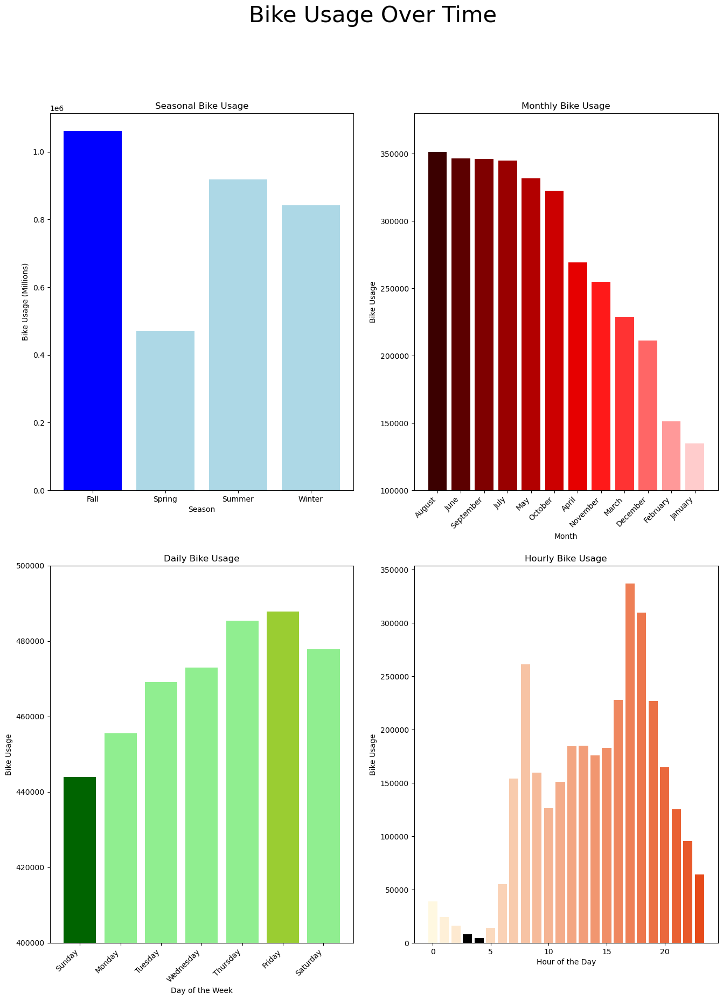
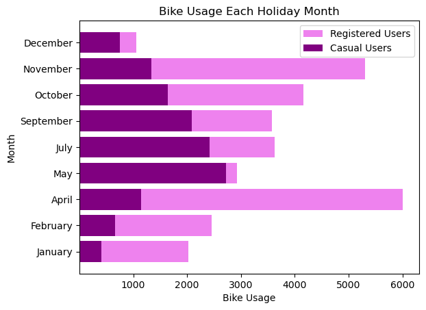

## Visualizations

This file entails a quick overview of the work done to produce the visuals. Five time-based visuals were created to show increasingly-specified bike usage over time. Overall, this includes seasonal, monthly, daily, and hourly bike usage.

### At a Glance Answers:

1. **Fall** is the busiest season, **August** is the busiest month, **Friday** is the busiest day, and **evening hours** are the busiest times.
    - **Spring** is the driest season, **January** is the driest month, **Sunday** is the driest day, and **early morning** hours (between 3-4am) are the driest times.

 

2. Since bikes are typically only replaced when deemed necessary, I looked more into the days of the week and times of day that would be suitable for maintenance.
    - Typically, **Thurs/Fri/Sat** are the most used days, with the most used hours remaining consistent with the overall most used hours.
    - The least used days are **Sun/Mon/Tues**, with the times also remaining consistent with the overall least busy hours.
    - The *least busiest* hours are: **4am, 3am, 2am**. The *busiest* hours are **5pm, 6pm, 8am**.

 

3. The holidays show something else that's interesting. **April** is the highest registered users use, and **November** follows closely behind.  **December** is the least used month.

## Process:

The process for creating the visuals was not extensive. For simplicity's sake, I created a 2x2 figure to plot 4 charts, with increasing magnifying times. Going from top left to bottom right, I charted bike usage by:

**Season**

**Month**

**Day**

**Hour**

Doing this puts all the overall time-based charts into one PNG, something that will be very useful for at-a-glance insights.

Furthermore, key points were highlighted with contrasting colors and sorted values to allow for quick digestion of information.

- **Axis 1:** Dark blue bar for the highest season for bike usage.

- **Axis 2:** Months are ordered from greatest to least bike usage, colored from darkest to lights in a red gradient.

- **Axis 3:** Lowest daily usage highlighted in dark green, whereas the highest daily usage was highlighted in a deeper light green.

**Axis 4:** The two lowest hours are painted black, contrasted against the orange gradient bars.

### **Holidays**

The last bar chart is bike usage, per month, only for holiday days. I split the bike usage by registered and casual users, which is defined in the ``README_cleaning_EDA.md``.

The bars are also stacked, with their total length representing their bike usage, not just their endpoint.

